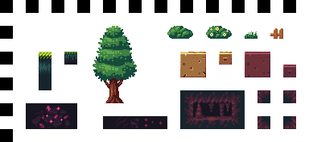

# Cours : Création d'un Flappy Bird avec Godot

## Introduction
- Présentation de Godot et de ses fonctionnalités
- Objectif du cours : créer un jeu Flappy Bird
---
## Récupération du projet

### Cours : Introduction à Godot
- Présentation de l'interface de Godot
- Explication des projets et des scènes

### TP : Récupération du projet
| Étape | Description |
|-------|-------------|
| 1 | Aller récupérer le projet vide à l’adresse suivante : https://github.com/cmardon/flappy_course |
| 2 | Dézippe le fichier (si téléchargé en .zip) |
| 3 | Ouvrir Godot 4.4.x et importer le projet |

---
## Création du joueur

### Cours : Les bases de Godot
- Explication des noeuds et des scènes
- Introduction aux scripts GDScript
- Notions de base sur les inputs

### TP : Création du joueur
| Étape | Description |
|-------|-------------|
| 1 | Dans `src/`, créer une nouvelle scène nommée ` joueur ` avec comme noeud de base `CharacterBody2D` |
| 2 | Dans la scène, ajouter un sprite 2D |
| 3 | Attacher une texture : Sélectionner une texture dans `Sunny Land Collection Files/Assets/Characters/` |
| 4 | Ajouter un script au joueur et y coller le code de chute libre |
```gdscript
extends CharacterBody2D

var gravity = 1000
var jump_strength = 600

func _process(delta):
    velocity.y += gravity * delta
    move_and_slide()
```
| Étape | Description |
|-------|-------------|
| 5 | Tester avec F6 |
| 6 | Modifier `_process` pour y inclure le saut |
```gdscript
func _process(delta):
    velocity.y += gravity * delta
    if Input.is_action_just_pressed("ui_accept"):
        velocity.y = -jump_strength
    move_and_slide()
```
| Étape | Description |
|-------|-------------|
| 7 | Tester avec F6 |

---
## Création du niveau

### Cours : Les scènes et les noeuds
- Explication des scènes et des noeuds
- Introduction à la manipulation des objets dans une scène
- Inspecteur

### TP : Création du niveau
| Étape | Description |
|-------|-------------|
| 1 | Dans `src/`, créer une nouvelle scène 2D nommée `niveau1` |
| 2 | Glisser `joueur.tscn` au milieu de la scène `niveau1` et changer le paramètre `scale` dans l'inspecteur en x:2 et y:2 |
| 3 |  Tester avec F5 en sélectionnant la scène actuelle comme scène principale |
---
## Découverte de la scène tuyau.tscn

### Explications
- Scène préfaite avec option dynamiques

### TP : Découverte de la scène tuyau.tscn
| Étape | Description |
|-------|-------------|
| 1 | Ouvrir la scène `src/tuyau.tscn` |

---
## Ajout de spawner à tuyau

### Cours : Les Timers et les Signaux
- Explication des Timers et de leur utilisation
- Introduction aux signaux et à leur connexion

### TP : Ajout de spawner à tuyau
| Étape | Description |
|-------|-------------|
| 1 | Aller dans la scène ` niveau1 ` |
| 2 | Ajouter un noeud 2D nommé ` generateur_tuyau ` |
| 3 | Déplacer le noeud à droite de l’écran avec l'outil de déplacement |
| 4 | Ajouter un Timer et activer ` autostart ` |
| 5 | Attacher un script au générateur et coller le code fourni |
```gdscript
extends Node2D

@onready var scene_tuyau = preload("res://src/tuyau.tscn")

func _ready():
    generer_tuyau()

func _on_timer_timeout():
    generer_tuyau()

func generer_tuyau():
    var pipe = scene_tuyau.instantiate()
    add_child(pipe)
```
| Étape | Description |
|-------|-------------|
| 6 | Connecter le signal `timeout` du Timer en cliquant sur le Timer puis dans l'inspecteur, cliquer sur Noeud > timeout() > connecter > generateur tuyau > connecter |
| 7 | Modifier le timer pour changer la vitesse d’apparition |
| 8 | Ajuster la taille du générateur à 2 (dans l'inspecteur, scale x:2 y:2)|

- Tester avec F5
---
## Ajout des collisions joueur

### Cours : Les Collisions
- Explication des CollisionShape2D
- Introduction aux différentes formes de collisions

### TP : Ajout des collisions joueur
| Étape | Description |
|-------|-------------|
| 1 | Aller sur la scène ` Joueur ` et ajouter un ` CollisionShape2D ` |
| 2 | Dans l’inspecteur, cliquer sur ```Shape : <vide>``` pour sélectionner CircleShape2D |
| 3 | Adapter la taille de la boîte de collision pour qu'elle recouvre globalement le joueur |

---
## Ajout de collision tuyaux

### Cours : Les StaticBody2D et les CollisionShape2D
- Explication des StaticBody2D et des CollisionShape2D (leur rôle)
- Introduction aux différentes manières de gérer les collisions

### TP : Ajout de collision tuyaux
| Étape | Description |
|-------|-------------|
| 1 | Aller sur la scène ` Tuyau ` et sélectionner `tuyau_haut` |
| 2 | Ajouter un noeud ` StaticBody2D ` |
| 3 | Ajouter une ` CollisionShape2D ` au ` StaticBody2D ` |
| 4 | Placer la boîte de collision au bon endroit en l’adaptant à la forme du tuyau du haut |
| 5 | Recommencer la même manipulation sur le tuyau du bas |
---
## Ajout de détection tuyaux

### Cours : Les Area2D et les Signaux
- Explication des Area2D et de leur utilisation (son rôle)
- Introduction aux signaux et à leur connexion

### TP : Ajout de détection tuyaux
| Étape | Description |
|-------|-------------|
| 1 | Remplacer les StaticBody2D par des ` Area2D ` |

Faisable en recommençant les étapes de la partie précédente, mais avec une Area2D plutôt qu'un StaticBody2D :
| Étape | Description |
|-------|-------------|
| 1 | Aller sur la scène ` Tuyau ` et sélectionner `tuyau_haut` |
| 2 | Ajouter un noeud ` Area2D ` |
| 3 | Ajouter une ` CollisionShape2D ` au ` Area2D ` |
| 4 | Placer la boîte de collision au bon endroit en l’adaptant à la forme du tuyau du haut |
| 5 | Recommencer la même manipulation sur le tuyau du bas |
| 6 | Sélectionner une Area2D puis dans l’inspecteur, cliquer sur l’onglet ` Noeud ` et double cliquer sur ` body_entered ` puis connecter. Enfin, remplacer ` pass ` par le code fourni |
| 7 | Connecter l'autre Area2D de la même manière |
```gdscript
func _on_area_2d_body_entered(body: Node2D) -> void:
    if body is CharacterBody2D:
        get_tree().change_scene_to_file("res://src/niveau1.tscn")
```
- Tester avec F5
---
## Ajout du fond avec TileMap

### Cours : Les TileMaps

* Introduction aux TileMaps

### TP : Ajout d’un fond avec TileMap

| Étape | Description|
| ----- | -------------------------------------------------------------------------------------------------------------------------------------------------------------------------------------- |
| 1     | Aller dans la scène `niveau1`|
| 2     | Ajouter un noeud `TileMapLayer`|
| 3     | Sélectionner le `TileMapLayer` ajouté, puis dans l'inspecteur, cliquer sur `Tile Set : <vide>` et choisir `Nouveau TileSet`|
| 4     | Tout en bas de l'éditeur, cliquer sur le bouton **"TileSet"** pour ouvrir l’éditeur de tuiles|
| 5     | Dans le système de fichiers (en bas à gauche de l'écran), rechercher une image de tileset, puis la **glisser dans le rectangle "Tile source"** de l’éditeur TileSet. Puis cliquer sur oui dans la fenêtre qui apparaît|

Exemple de TileSet valide : 

| Étape | Description|
| ----- | -------------------------------------------------------------------------------------------------------------------------------------------------------------------------------------- |
| 6     | Tout en bas de l'éditeur, cliquer sur le bouton **"TileMap"** |
| 7     | Sélectionner des blocs de la tilemap et dessiner sur le niveau pour créer un décor|
| 8     | Glisser le noeud `TileMapLayer` au dessus du joueur et du générateur de tuyaux dans l'arborescence à gauche dans l'onglet  `Scène`|
| 9     | Tester les outils de lignes, de zones, ajouter un fond en glissant un png directement sur la scène si besoin |

- Tester avec F5

- Ne pas hésiter à mettre un autre `TileMapLayer` si on veut utiliser deux tileset en même temps (Pour le sol et pour le ciel par exemple)
---
## Effet de rotation du joueur

### Cours : Transformations et animation manuelle

* Présentation de la propriété `rotation_degrees`
* Utilisation de la fonction `clamp()` pour limiter l'angle
* Explication de l'effet de "bascule" pendant la chute et le saut

### TP : Ajout de la rotation

| Étape | Description                                  |
| ----- | -------------------------------------------- |
| 1     | Aller dans le script du joueur               |
| 2     | Modifier `_process` pour inclure la rotation |

```gdscript
func _process(delta):
    velocity.y += gravity * delta
    if Input.is_action_just_pressed("ui_accept"):
        velocity.y = jump_strength

    rotation_degrees = clamp(velocity.y * 0.1, -30, 90)
    move_and_slide()
```

- Tester avec F5

---

## Ajout d'effets sonores

### Cours : AudioStreamPlayer2D

* Présentation du noeud `AudioStreamPlayer2D`
* Explication sur l’importation des sons (WAV, OGG...)
* Déclenchement de sons via GDScript

### TP : Musique de fond

| Étape | Description                                                                          |
| ----- | ------------------------------------------------------------------------------------ |
| 1     | Dans la scène `niveau1`, ajouter un noeud `AudioStreamPlayer2D` |
| 2     | Aller dans le dossier `SunnyLand Music/` et double cliquer sur une musique pour l'écouter puis choisir une musique |
| 3     | Dans l'inspecteur après avoir cliqué sur l'`AudioStreamPlayer2D` de la scène, glisser la musique dans `Stream : <vide>`|
| 4 | Cocher `Autoplay` pour lancer le son dès le début du niveau|

### TP : Son de saut

| Étape | Description                                                                          |
| ----- | ------------------------------------------------------------------------------------ |
| 1     | Aller dans la scène `joueur`|
| 2     | Ajouter un noeud `AudioStreamPlayer2D` et renomme le `son_saut` (sans majuscules) |
| 3     | Aller dans le dossier `sfx/platformer_jumping`|
| 4     | Glisser un son de saut dans le champ `Stream : <vide>` de l'inspecteur du noeud son_saut |
| 5     | Dans le script du joueur, modifier la fonction _process() comme ceci:|

```gdscript
func _process(delta):
    velocity.y += gravity * delta
    if Input.is_action_just_pressed("ui_accept"):
        velocity.y = jump_strength
        $son_saut.play()

    rotation_degrees = clamp(velocity.y * 0.1, -30, 90)
    move_and_slide()
```

### TP : Son de mort

| Étape | Description                                                                          |
| ----- | ------------------------------------------------------------------------------------ |
| 1     | Aller dans la scène `tuyau`|
| 2     | Ajouter un noeud `AudioStreamPlayer2D` et renomme le `son_mort` (sans majuscules) |
| 3     | Aller dans le dossier `sfx/gameover`|
| 4     | Glisser un son de mort dans le champ `Stream : <vide>` de l'inspecteur du noeud son_mort |
| 5     | Dans le script du tuyau, modifier la fonction _on_area_2d_body_entered() comme ceci:|

```gdscript
func _on_area_2d_body_entered(body: Node2D) -> void:
    if body is CharacterBody2D:
        $son_mort.process_mode = Node.PROCESS_MODE_ALWAYS
        get_tree().paused = true
        $son_mort.play()
        await get_tree().create_timer($son_mort.stream.get_length(), true).timeout
        get_tree().paused = false
        get_tree().change_scene_to_file("res://src/niveau1.tscn")
```

---

## Dynamisation du joueur

### Cours : Dynamisation

* Objectif : Ne pas avoir à revenir dans le code à chaque fois
* Utilisation de @export
* Notion @tool


### TP : Dynamisation du joueur

| Étape | Description                                               |
| ----- | --------------------------------------------------------- |
| 1     | Aller dans la scène du joueur                             |
| 2     | Ouvrir le script du joueur                                |
| 3     | Remplacer le script par le suivant :                      |

```gdscript
@tool
extends CharacterBody2D

@export var gravity: float = 1000
@export var jump_strength: float = 600
@export var player_scale: Vector2 = Vector2(2, 2)

@export var sprite_texture: Texture2D:
	set(value):
		sprite_texture = value
		if sprite and sprite_texture:
			sprite.texture = sprite_texture

@onready var sprite: Sprite2D = $Sprite2D

func _process(delta):
	scale = player_scale
	if !Engine.is_editor_hint():
		# Exécution normale en jeu
		velocity.y += gravity * delta
		if Input.is_action_just_pressed("ui_accept"):
			velocity.y = -jump_strength
			$AudioStreamPlayer2D.play()
		rotation_degrees = clamp(velocity.y * 0.1, -30, 90)
		move_and_slide()


```

| Étape | Description                                                                                               |
| ----- | --------------------------------------------------------------------------------------------------------- |
| 4     | Retourner dans la scène `niveau1` et cliquer sur `joueur`|
| 5     | Modifier les paramètres du joueur |

- Tester avec F5

### Résultat

Il est possible de modifier :
- La gravité, la force du saut et la taille du joueur (dans le noeud `joueur` de la scène `niveau1` directement)
- Le temps d'apparition des tuyaux (dans le `Timer` du `niveau1`)
- L'écart entre les tuyaux (en hauteur) et leur vitesse (dans la scène `tuyau` en cliquand sur le noeud principal en haut de l'aborescence)
- Le son du niveau (En cliquant sur le `AudioStreamPlayer2D` et en sélectionnant un nouveau son)
- Le décor (avec les TileMapLayer)
